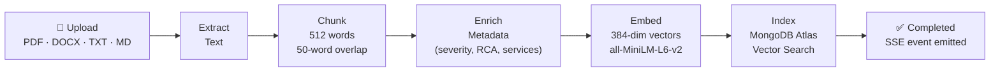
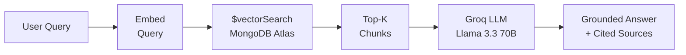
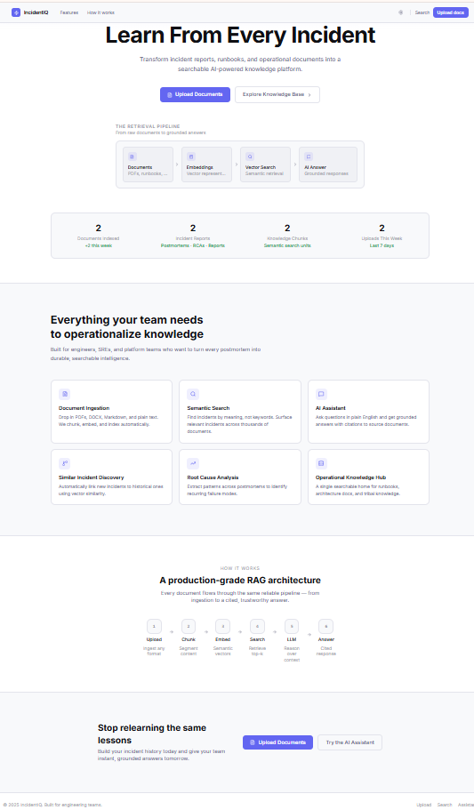
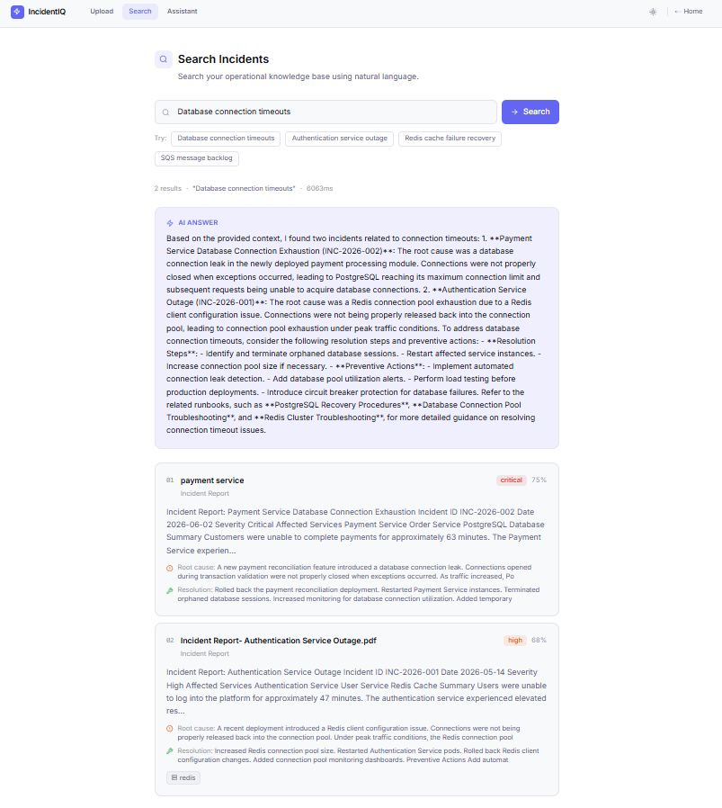
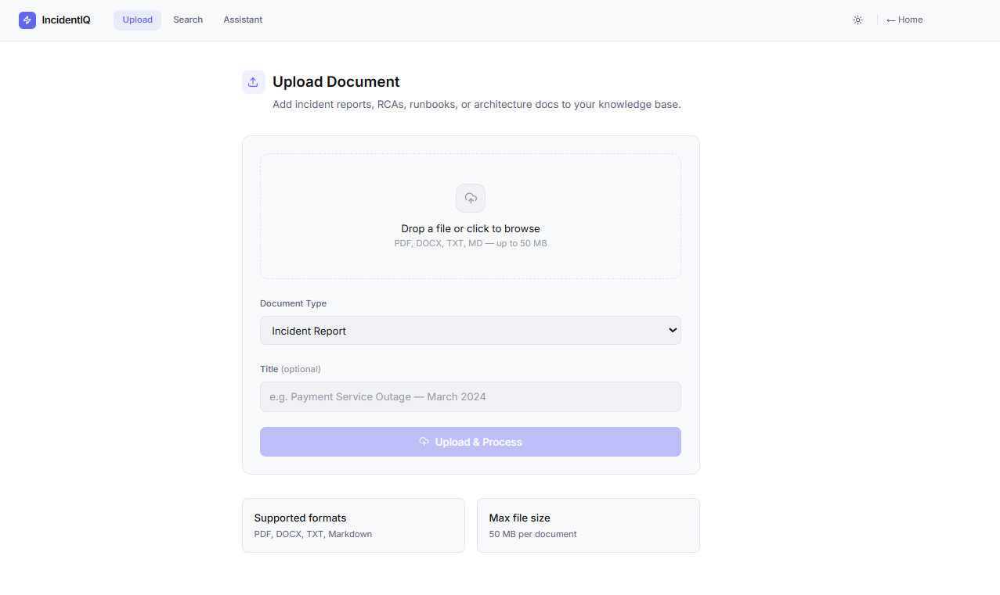
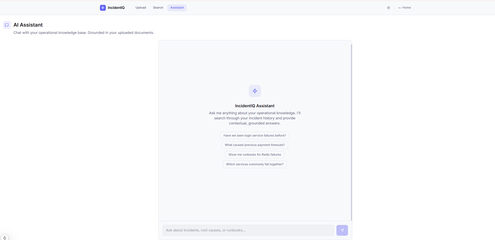

<div align="center">

# ⚡ IncidentIQ

**AI-powered Incident Intelligence Platform**

*Learn from every incident. Surface historical knowledge instantly. Resolve faster.*

[](https://python.org)
[](https://fastapi.tiangolo.com)
[](https://nextjs.org)
[](https://www.mongodb.com/atlas)
[](https://groq.com)
[](LICENSE)

[Quick Start](#quick-start) · [Architecture](#architecture) · [API Reference](#api-endpoints) · [Roadmap](#roadmap)

</div>

---

## Overview

IncidentIQ transforms unstructured incident documents — postmortems, RCAs, runbooks, architecture docs — into a semantically searchable, AI-powered knowledge base.

Engineering teams stop re-investigating the same failures and get instant, cited answers from their own operational history.

| Problem | IncidentIQ Solution |
|---|---|
| Recurring incidents re-investigated from scratch | Semantic search surfaces previous resolutions instantly |
| RCA documents buried across Confluence, Notion, Drives | Centralized repository with AI-powered retrieval |
| New engineers lack operational context | Ask the AI assistant in plain English |
| No visibility into recurring failure modes | Similar incident discovery with root cause mapping |

---

## Architecture

### Clean Architecture Layers

Dependencies always point **inward**. The Domain layer has zero framework dependencies.

```
┌─────────────────────────────────────────────────────┐
│                  Presentation Layer                 │
│         FastAPI Routes  ·  Next.js 15 UI            │
└──────────────────────┬──────────────────────────────┘
                       ↓
┌─────────────────────────────────────────────────────┐
│                  Application Layer                  │
│         Services  ·  Use Cases  ·  DTOs             │
└──────────────────────┬──────────────────────────────┘
                       ↓
┌─────────────────────────────────────────────────────┐
│                   Domain Layer                      │
│   Entities  ·  Repository Interfaces  ·             │
│   Value Objects  ·  Business Rules                  │
└──────────────────────▲──────────────────────────────┘
                       │ (implemented by)
┌─────────────────────────────────────────────────────┐
│                Infrastructure Layer                 │
│   MongoDB Atlas  ·  Groq LLM  ·                    │
│   SentenceTransformers  ·  Local File Storage       │
└─────────────────────────────────────────────────────┘
```

### Document Ingestion Pipeline



### RAG Query Pipeline



---

## Features

**V1 — Current Release**

- **Document Ingestion** — Upload PDF, DOCX, TXT, Markdown files up to 50 MB
- **Real-time Progress** — Server-Sent Events stream pipeline status from upload through indexing
- **Semantic Search** — Vector similarity search with MongoDB Atlas `$vectorSearch`
- **RAG-Powered Answers** — AI-generated answers grounded in your corpus, with source citations
- **Similar Incident Discovery** — Find historical incidents related to any document or query text
- **AI Knowledge Assistant** — Conversational interface with full RAG context and runbook suggestions
- **Metadata Extraction** — Automatic extraction of severity, root cause, resolution, and affected services
- **Clean Architecture** — Strictly layered; every infrastructure component is swappable via interfaces
- **MCP-Ready** — Tool stubs for MCP Server integration are already defined (V5 implementation)

---

## Tech Stack

| Layer | Technology | Notes |
|---|---|---|
| **Frontend** | Next.js 15, TypeScript | App Router, React Server Components |
| **Styling** | Tailwind CSS v3, CSS Variables | Custom design system, dark / light themes |
| **Backend** | FastAPI, Python 3.12 | Async throughout — Motor, aiofiles, SSE |
| **Validation** | Pydantic v2 | Request/response schemas + settings |
| **Database** | MongoDB Atlas | Document store + metadata |
| **Vector Search** | MongoDB Atlas Vector Search | `$vectorSearch` aggregation |
| **LLM** | Groq API (Llama 3.3 70B) | RAG answer generation |
| **Embeddings** | sentence-transformers/all-MiniLM-L6-v2 | 384-dimensional vectors |
| **Real-time** | Server-Sent Events | Processing progress streaming |
| **Logging** | structlog | JSON logs in production, console in dev |
| **Testing** | pytest, pytest-asyncio, httpx | Async unit + integration tests |

---

## Project Structure

```
incidentiq/
├── .env.example                     # Environment variable template
├── .gitignore
├── docker-compose.yml
├── README.md
│
├── docs/                            # Architecture Decision Records + guides
│   ├── adr/                         # ADR-001 → ADR-004
│   ├── api/API-Design.md
│   ├── architecture/
│   └── Development-Guide.md
│
└── apps/
    ├── frontend/                    # Next.js 15 application
    │   └── src/
    │       ├── app/                 # App Router pages (/, /upload, /search, /assistant)
    │       ├── components/          # Navbar, ThemeToggle, StatsBar, providers
    │       ├── features/            # Upload, Search, Assistant feature components
    │       ├── hooks/               # useSearch, useStats, useSSE custom hooks
    │       ├── services/            # api.ts — typed fetch client
    │       └── types/               # Shared TypeScript types
    │
    └── backend/                     # FastAPI application
        ├── main.py                  # App factory + route registration + lifespan
        ├── requirements.txt
        │
        ├── api/                     # Presentation layer
        │   ├── routes/              # health, documents, search, assistant, stats
        │   └── dependencies/        # FastAPI DI providers (providers.py)
        │
        ├── core/                    # Cross-cutting concerns
        │   ├── config/settings.py   # Pydantic BaseSettings
        │   ├── constants/           # Enums, prompts, limits
        │   └── logging/             # structlog configuration
        │
        ├── domain/                  # Pure business logic — zero framework deps
        │   ├── entities/            # Document, Incident, Chunk
        │   ├── value_objects/       # DocumentType, Severity
        │   ├── enums/               # DocumentStatus, ProcessingStage
        │   ├── exceptions/          # Typed domain exceptions
        │   └── repositories/        # Abstract repository interfaces
        │
        ├── application/             # Orchestration layer
        │   ├── dto/                 # Pydantic I/O models
        │   ├── interfaces/          # IEmbeddingProvider, ILLMProvider, …
        │   ├── services/            # DocumentService, SearchService, AIAssistantService
        │   └── use_cases/           # UploadDocument, SearchIncidents, AskAssistant, …
        │
        ├── infrastructure/          # External service implementations
        │   ├── database/            # Motor client + MongoDB repositories
        │   ├── embeddings/          # SentenceTransformer provider
        │   ├── llm/groq/            # AsyncGroq provider
        │   ├── storage/             # Async local file storage
        │   └── vector_store/        # MongoDB $vectorSearch implementation
        │
        ├── ingestion/               # Document processing pipeline
        │   ├── extractors/          # PDF (pypdf), DOCX (python-docx), plain text
        │   ├── chunkers/            # Sliding window text chunker
        │   ├── enrichers/           # Regex metadata extractor
        │   └── pipelines/           # Async 8-stage pipeline with progress callbacks
        │
        ├── mcp/tools/               # V5: MCP Server tool stubs
        └── tests/
            ├── unit/                # Domain + ingestion tests (no I/O)
            └── integration/         # HTTP layer tests (mocked dependencies)
```

---

## Quick Start

### Prerequisites

- Python 3.12+
- Node.js 20+
- [MongoDB Atlas](https://www.mongodb.com/atlas) account — free tier works
- [Groq API key](https://console.groq.com) — free tier works

### 1. Clone and configure

```bash
git clone https://github.com/<your-username>/incidentiq.git
cd incidentiq
cp .env.example .env
# Edit .env — fill in MONGODB_URI and GROQ_API_KEY
```

### 2. Create the MongoDB Atlas Vector Search index

In the Atlas UI: **Atlas Search → Create Search Index → JSON Editor**.  
Select the `chunks` collection and paste:

```json
{
  "fields": [
    {
      "type": "vector",
      "path": "embedding",
      "numDimensions": 384,
      "similarity": "cosine"
    }
  ]
}
```

Name the index `incidentiq_vector_index`.

### 3. Start the backend

```bash
cd apps/backend
python -m venv .venv
source .venv/bin/activate          # Windows: .venv\Scripts\activate
pip install -r requirements.txt
uvicorn main:app --reload --port 8000
```

Interactive API docs → http://localhost:8000/docs

### 4. Start the frontend

```bash
cd apps/frontend
npm install
# Create apps/frontend/.env.local with:
# NEXT_PUBLIC_API_URL=http://localhost:8000/api/v1
npm run dev
```

Open http://localhost:3000

---

## Environment Variables

| Variable | Required | Default | Description |
|---|---|---|---|
| `MONGODB_URI` | ✅ | — | MongoDB Atlas connection string |
| `MONGODB_DATABASE` | | `incidentiq` | Database name |
| `GROQ_API_KEY` | ✅ | — | Groq API key |
| `GROQ_MODEL` | | `llama-3.3-70b-versatile` | Model identifier |
| `GROQ_MAX_TOKENS` | | `2048` | Max tokens per LLM response |
| `EMBEDDING_MODEL` | | `sentence-transformers/all-MiniLM-L6-v2` | HuggingFace model |
| `VECTOR_DIMENSIONS` | | `384` | Must match embedding model output |
| `VECTOR_INDEX_NAME` | | `incidentiq_vector_index` | Atlas Search index name |
| `APP_ENV` | | `development` | `development` or `production` |
| `DEBUG` | | `true` | Verbose console logging |
| `APP_SECRET_KEY` | ✅ | — | 32+ character secret key |
| `UPLOAD_DIR` | | `/tmp/incidentiq/uploads` | File storage path |
| `MAX_FILE_SIZE_MB` | | `50` | Upload size limit |
| `ALLOWED_ORIGINS` | | `http://localhost:3000` | Comma-separated CORS origins |

---

## API Endpoints

Base URL: `http://localhost:8000`

### Health

| Method | Path | Description |
|---|---|---|
| `GET` | `/health` | Liveness probe |
| `GET` | `/health/ready` | Readiness probe — pings MongoDB |

### Documents

| Method | Path | Description |
|---|---|---|
| `POST` | `/api/v1/documents` | Upload document (202 + stream URL) |
| `GET` | `/api/v1/documents` | List documents (paginated) |
| `GET` | `/api/v1/documents/{id}` | Get document details |
| `DELETE` | `/api/v1/documents/{id}` | Delete document and its chunks |
| `GET` | `/api/v1/documents/{id}/stream` | SSE stream for processing events |

### Search

| Method | Path | Description |
|---|---|---|
| `POST` | `/api/v1/search` | Semantic search with optional RAG answer |
| `POST` | `/api/v1/search/similar` | Find similar incidents by document ID or text |

### Assistant

| Method | Path | Description |
|---|---|---|
| `POST` | `/api/v1/assistant/chat` | Chat with the RAG-powered AI assistant |

### Platform

| Method | Path | Description |
|---|---|---|
| `GET` | `/api/v1/stats` | Platform statistics |

---

## Sample Queries

**Upload a document**

```bash
curl -X POST http://localhost:8000/api/v1/documents \
  -F "file=@postmortem.pdf" \
  -F "document_type=postmortem" \
  -F "title=Database failover — 2025-06-10"
```

**Semantic search with AI answer**

```bash
curl -X POST http://localhost:8000/api/v1/search \
  -H "Content-Type: application/json" \
  -d '{
    "query": "postgres connection pool exhaustion",
    "limit": 5,
    "include_ai_answer": true
  }'
```

**Find similar incidents**

```bash
curl -X POST http://localhost:8000/api/v1/search/similar \
  -H "Content-Type: application/json" \
  -d '{
    "text": "redis cache miss cascade causing upstream timeout",
    "limit": 3
  }'
```

**Chat with the assistant**

```bash
curl -X POST http://localhost:8000/api/v1/assistant/chat \
  -H "Content-Type: application/json" \
  -d '{
    "message": "What were the root causes of our most critical database incidents?"
  }'
```

---

## Running Tests

```bash
cd apps/backend
source .venv/bin/activate

pytest                              # All tests
pytest tests/unit/                  # Unit tests only — no external dependencies
pytest tests/integration/           # API tests with mocked dependencies
pytest -v --tb=short                # Verbose
pytest --cov=. --cov-report=html    # Coverage report → htmlcov/index.html
```

---

## Screenshots

| Landing Page | Semantic Search |
|---|---|
|  |  |

| Document Upload | AI Assistant |
|---|---|
|  |  |

---

## Quick Demo

A full demo dataset is included in [`docs/sample-data/`](docs/sample-data/). Six realistic enterprise incident reports cover authentication outages, database connection exhaustion, cache failures, message queue backlogs, API gateway latency spikes, and Kubernetes crash loops.

### Step 1 — Upload all sample documents

```bash
for f in docs/sample-data/*.md; do
  curl -s -X POST http://localhost:8000/api/v1/documents \
    -F "file=@$f" \
    -F "document_type=postmortem" \
    -F "title=$(basename $f .md)" > /dev/null
  echo "Uploaded: $f"
done
```

Or drag-and-drop each file through the **Upload** UI at http://localhost:3000/upload.

### Step 2 — Open the Search or Assistant page

- **Semantic Search** → http://localhost:3000/search — returns ranked document chunks with similarity scores.
- **AI Assistant** → http://localhost:3000/assistant — RAG-powered answers with cited sources.

### Step 3 — Try these queries

| # | Query | What it demonstrates |
|---|---|---|
| 1 | `What caused the authentication outage?` | Basic retrieval — single-document answer |
| 2 | `How was the payment service database incident resolved?` | Resolution retrieval |
| 3 | `Show incidents related to connection leaks` | Cross-document similarity — two different services, same root cause pattern |
| 4 | `Find incidents involving resource exhaustion` | Multi-document retrieval across 4 incidents |
| 5 | `Have we seen Redis failures before?` | Historical pattern discovery across INC-001 and INC-003 |
| 6 | `Which incidents were caused by code deployments?` | Root cause category filtering |
| 7 | `What monitoring gaps were identified across incidents?` | Aggregated operational intelligence |
| 8 | `Which incidents impacted customer transactions?` | Business impact cross-reference |
| 9 | `What recurring root causes appear across incidents?` | Multi-document reasoning and pattern synthesis |
| 10 | `Find incidents caused by misconfiguration` | Semantic category matching across INC-001 and INC-004 |

### Step 4 — Observe

Each answer includes:
- The AI-generated answer grounded in your uploaded documents
- Source citations (document title, chunk excerpt)
- Similarity scores for retrieved chunks

> Full query catalog with expected answers: [`docs/sample-queries.md`](docs/sample-queries.md)

---

## Included Demo Dataset

Six sample incident reports in [`docs/sample-data/`](docs/sample-data/):

| File | Incident | Severity | Root Cause Category | Demonstrates |
|---|---|---|---|---|
| `INC-2025-001-authentication-service-outage.md` | Auth service down — Redis pool exhausted | SEV1 | Misconfiguration | Basic retrieval, configuration failure pattern |
| `INC-2025-002-payment-service-db-connection-exhaustion.md` | Payment DB connection leak | SEV1 | Code regression | Cross-doc similarity with INC-001 (both: connection exhaustion) |
| `INC-2025-003-redis-cache-failure-cache-stampede.md` | Redis OOM → cache stampede | SEV2 | Resource exhaustion | Cross-doc similarity with INC-001 (both: Redis); multi-doc root cause |
| `INC-2025-004-sqs-message-backlog-order-processing-delay.md` | Lambda stops consuming SQS — IAM misconfiguration | SEV2 | Misconfiguration | Silent failure pattern; cross-doc with INC-001 (both: misconfiguration) |
| `INC-2025-005-api-gateway-latency-spike.md` | N+1 call pattern saturates downstream services | SEV2 | Code regression | Latency cascade; cross-doc with INC-002 (both: code deployment regression) |
| `INC-2025-006-kubernetes-pod-crash-loop.md` | Jinja2 template memory leak → pod OOM kills | SEV3 | Memory leak | Slow-burn resource exhaustion; cross-doc with INC-003 (both: OOM) |

**Semantic search scenarios covered:**

- **Single-document retrieval** — direct factual queries about a specific incident
- **Cross-incident similarity** — two different services, same underlying failure pattern (connection exhaustion, Redis failure, OOM)
- **Category aggregation** — "find all incidents involving resource exhaustion" surfaces 4 documents
- **Operational intelligence** — "what recurring root causes appear" synthesizes a pattern across all 6 documents
- **Resolution retrieval** — "how was X resolved" extracts resolution steps from within a document
- **Business impact cross-reference** — "which incidents impacted transactions" reasons across business-domain context

---

## Demo Scenario

A focused 2-document demo showing cross-service semantic similarity:

Upload `INC-2025-001` (Redis connection pool exhaustion) and `INC-2025-002` (PostgreSQL connection leak). Then ask:

**`"Show incidents related to connection leaks."`**

The assistant retrieves **both** documents — even though they describe completely different services (Redis vs. PostgreSQL) — because the underlying failure pattern (connection pool exhaustion) is semantically identical. This is vector search in action: keyword search for "connection leak" would miss INC-2025-001, which uses the term "connection pool exhaustion."

---

## Roadmap

| Version | Feature |
|---|---|
| **V1** ✅ | Document ingestion, semantic search, RAG assistant, similar incident discovery |
| V2 | Service dependency visualization |
| V3 | Incident timeline analytics |
| V4 | AI-generated RCA summaries |
| V5 | MCP Server integration *(tool stubs already defined)* |
| V6 | Agentic incident investigation |
| V7 | Slack integration |
| V8 | Jira integration |
| V9 | Knowledge Graph (Neo4j) |
| V10 | Predictive incident intelligence |

---

## Deployment

### Backend on Render

1. Connect your GitHub repo to [Render](https://render.com)
2. Create a **Web Service**:
   - Root Directory: `apps/backend`
   - Build Command: `pip install -r requirements.txt`
   - Start Command: `uvicorn main:app --host 0.0.0.0 --port $PORT`
3. Add all environment variables from `.env.example`

### Frontend on Vercel

1. Import the repo in [Vercel](https://vercel.com)
2. Set **Root Directory** → `apps/frontend`
3. Add `NEXT_PUBLIC_API_URL` pointing to your Render backend URL

### Docker (local / self-hosted)

```bash
docker compose up --build
```

---

## Contributing

See [CONTRIBUTING.md](CONTRIBUTING.md) for development setup, branching strategy, and pull request guidelines.

---

## License

[MIT](LICENSE) © 2025 IncidentIQ Contributors
